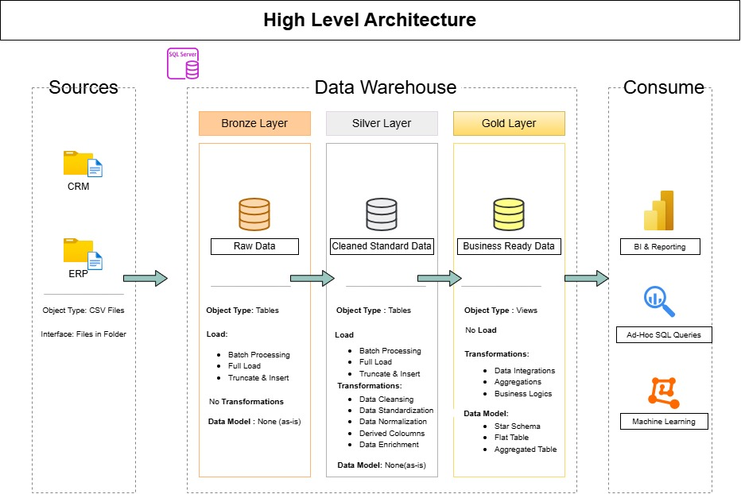

# Data Warehouse and Analytics Project

This project is a hands-on implementation of a modern data warehouse and analytics solution using SQL Server.

The project demonstrates the end-to-end process of building a data warehouse, starting from raw data ingestion and progressing through data cleaning, transformation, dimensional modeling, and analytical reporting.

The data is organized into Bronze, Silver, and Gold layers to support a structured and maintainable data pipeline. The project also covers data quality checks, ETL processes, fact and dimension tables, and SQL-based analytical queries.

This project is being developed as a learning exercise to gain practical experience with data warehousing, ETL, dimensional modeling, and analytics concepts.

## Architecture

This project follows the **Medallion Architecture**, which organizes data
into three layers: Bronze, Silver, and Gold.

### Bronze Layer

The Bronze layer contains the **raw data** loaded from the source systems.

The data is stored with minimal transformation so that the original source data is preserved. This layer serves as the initial landing area for the data and provides a reliable source for downstream processing.

### Silver Layer

The Silver layer contains **cleaned and transformed data**.

Data from the Bronze layer is validated, standardized, cleaned, and transformed to improve its quality and consistency. Issues such as invalid values, duplicates, inconsistent formats, and missing data are handled at this stage.

### Gold Layer

The Gold layer contains **business-ready data** designed for analytics and reporting.

The transformed data is organized into **fact and dimension tables**, forming a dimensional model that makes it easier to perform analytical queries and generate business insights.

### Data Flow

The overall data flow can be summarized as:

**Source Systems → Bronze → Silver → Gold → Analytics**

This layered approach separates raw data from transformed and business-ready data, making the data pipeline easier to understand, maintain, and extend.

---
## Project Overview

This project covers the development of a modern data warehouse and analytics solution using SQL Server.

The main components of the project include:

1. **Data Architecture**: Designing a data warehouse using the Medallion Architecture with Bronze, Silver, and Gold layers.
2. **ETL Pipelines**: Extracting, transforming, and loading data from source systems into the data warehouse.
3. **Data Modeling**: Designing fact and dimension tables to support analytical queries and reporting.
4. **Analytics and Reporting**: Developing SQL-based analyses to generate meaningful business insights.

---
## Project Requirements

### 1. Building the Data Warehouse

#### Objective

The objective is to build a modern data warehouse using SQL Server that consolidates sales-related data from multiple source systems and prepares it for analytical reporting.

#### Requirements

- **Data Sources**: Load data from two source systems, ERP and CRM, provided as CSV files.
- **Data Quality**: Identify and resolve data quality issues before the data is used for analysis.
- **Data Integration**: Combine data from both source systems into a consistent and user-friendly analytical data model.
- **Data Scope**: The project focuses on the latest available dataset. Historical data tracking is outside the scope of this project.
- **Documentation**: Document the data model and the overall solution to make it understandable for both technical and business users.

### 2. Analytics and Reporting

#### Objective

The objective is to develop SQL-based analytical queries that provide insights into key business areas, including:

- **Customer Behavior**
- **Product Performance**
- **Sales Trends**

The resulting analysis provides business metrics that can be used to understand sales performance and customer and product trends.

